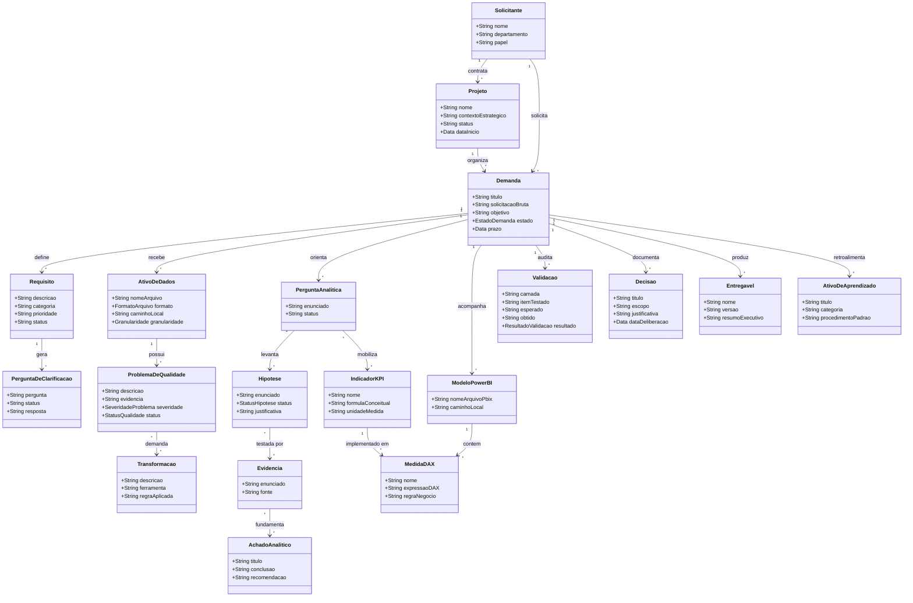

# Modelo de Domínio Conceitual da V1 — Analyst Personal Workspace

## 1. Objetivo do Modelo de Domínio

O **Modelo de Domínio Conceitual da V1** traduz as regras de negócio, a visão de produto e o workflow operacional aprovados em uma representação formal, coesa e rastreável das entidades que compõem o universo de trabalho do analista de dados no **Analyst Personal Workspace**.

Este modelo existe para:
1. **Representar o Trabalho Profissional Real**: Mapear os conceitos exatos que um analista de Dados e Business Intelligence (BI) utiliza no dia a dia com Excel, Power Query e Power BI;
2. **Garantir Rastreabilidade Ponta a Ponta**: Assegurar que cada decisão, hipótese, cálculo e entrega esteja conectado conceitualmente à demanda original e às evidências numéricas;
3. **Formalizar a Colaboração Humano + IA**: Estabelecer limites conceituais claros entre sugestões geradas pela IA e deliberações soberanas aprovadas pelo analista humano;
4. **Servir de Base Semântica Desacoplada**: Fornecer a base semântica para a camada de persistência da aplicação, sem acoplar o domínio a implementações físicas prematuras.

---

## 2. Princípios de Modelagem

A modelagem conceitual do Workspace é regida pelos seguintes princípios inegociáveis:

1. **Rastreabilidade Bidirecional e Não Linear**: Deve ser possível navegar a partir de uma métrica em um relatório final até a demanda que a originou e, inversamente, da solicitação inicial até os artefatos entregues e validados. O modelo preserva ramificações e relações muitos-para-muitos inerentes ao raciocínio analítico.
2. **Auditabilidade Integral**: Toda transformação de dados, tratamento de anomalia, hipótese, decisão e validação deve possuir autoria, motivação e justificativa registradas.
3. **Soberania e Autoridade Humana**: A IA opera como agente colaborador (sugerindo, estruturando e investigando), mas o domínio exige que ações de negócio e aprovações sejam formalmente atribuídas ao analista humano.
4. **Segregação Estrita entre Dados e Metadados**: O domínio modela metadados operacionais, regras, decisões e esquemas lógicos. Dados reais e confidenciais de clientes permanecem segregados no sistema de arquivos local, nunca sendo versionados ou embutidos diretamente no histórico da aplicação.
5. **Documentação Concorrente**: Entidades de documentação são geradas durante a execução das fases do projeto, combatendo a reconstrução tardia de histórico.
6. **Evolução Incremental e Sem Antecipação**: Apenas conceitos estritamente necessários ao ecossistema da V1 (Excel, Power Query, Power BI e fluxo de demandas) fazem parte deste modelo. Recursos previstos para versões posteriores estão expressamente excluídos.

---

## 3. Entidades Principais da V1

A seguir estão detalhadas as entidades aprovadas para a V1, suas responsabilidades, atributos conceituais e regras de negócio associadas.

---

### 3.1. Projeto
- **Definição**: Agrupador contextual e estratégico que organiza uma ou mais demandas de um mesmo cliente ou iniciativa de negócio (ex.: "Estruturação do BI Financeiro 2026", "Análise de Evasão Escolar").
- **Responsabilidade**: Fornecer a visão agregada macro de escopo, objetivos gerais, contexto institucional e status executivo no Centro de Comando.
- **Informações Conceituais Essenciais**:
  - Identificador único;
  - Nome do projeto;
  - Descrição e contexto estratégico;
  - Status geral;
  - Data de início e data de conclusão prevista/real.
- **Relações Principais**:
  - Pertence a um **Solicitante**;
  - Contém uma ou mais **Demandas** operacionais;
  - Agrega **Entregáveis** e marcos consolidados.
- **Momento no Workflow**: Fase 1 (Entrada da Demanda) e visão permanente no Centro de Comando.
- **Atores e Autoridade**: Criado e gerenciado pelo analista.
- **Regra de Domínio**: Em trabalhos pontuais ou contratos simples, o Projeto pode conter uma única Demanda correspondente, garantindo flexibilidade operacional sem burocracia desnecessária.

---

### 3.2. Demanda (Unidade Operacional do Workflow)
- **Definição**: Representa a unidade atômica de trabalho profissional que percorre o pipeline e o workflow operacional de ponta a ponta.
- **Responsabilidade**: Manter a coesão do ciclo de vida analítico, agregando requisitos, dados, análises, validações e entregáveis específicos.
- **Informações Conceituais Essenciais**:
  - Identificador único;
  - Título descritivo da demanda;
  - Solicitação bruta original (texto integral da entrada);
  - Contexto específico;
  - Objetivo inicial declarado;
  - Prazo ou expectativa temporal acordada;
  - Restrições declaradas;
  - Estado atual no pipeline;
  - Data de abertura e data de conclusão.
- **Relações Principais**:
  - Pertence a um **Projeto**;
  - Associada a um **Solicitante**;
  - Contém múltiplos **Requisitos**;
  - Gera **Perguntas de Clarificação**;
  - Utiliza múltiplos **Ativos de Dados**;
  - Origina **Perguntas Analíticas**;
  - Registra múltiplas **Decisões** transversais e **Validações**;
  - Produz múltiplos **Entregáveis**.
- **Momento no Workflow**: Transita da Fase 1 (Entrada) até a Fase 11 (Encerramento).
- **Atores e Autoridade**: Registrada pelo analista (com apoio da IA na estruturação inicial); transições de estado aprovadas exclusivamente pelo humano.
- **Regras de Negócio**:
  - Não pode avançar para o estado *Concluída* sem que todas as validações obrigatórias estejam aprovadas;
  - Campos não informados pelo cliente devem ser registrados explicitamente como pendências ou lacunas, nunca presumidos pela IA.

---

### 3.3. Solicitante (Stakeholder)
- **Definição**: Entidade ou pessoa externa responsável por solicitar a demanda e receber os entregáveis.
- **Responsabilidade**: Identificar a origem do negócio e o canal de contato para alinhamentos e entrega.
- **Informações Conceituais Essenciais**:
  - Nome do cliente ou contratante;
  - Departamento, organização ou área de negócio;
  - Papel / Função do contato;
  - Canal de comunicação preferencial.
- **Relações Principais**: Origina **Projetos** e **Demandas**.
- **Momento no Workflow**: Fase 1 (Entrada da Demanda).
- **Atores e Autoridade**: Cadastrado e gerenciado pelo analista.

---

### 3.4. Requisito
- **Definição**: Declaração explícita de uma necessidade analítica, regra de entrega ou critério de aceitação acordado com o solicitante.
- **Responsabilidade**: Balizar o escopo do que deve ser entregue e testado.
- **Informações Conceituais Essenciais**:
  - Descrição clara do requisito;
  - Categoria do requisito (entrega, métrica, usabilidade, conformidade);
  - Prioridade;
  - Status de atendimento (Pendente, Em Andamento, Atendido, Cancelado).
- **Relações Principais**:
  - Vinculado a uma **Demanda**;
  - Suportado por **Perguntas Analíticas** e **Indicadores / KPIs**;
  - Verificado por **Validações**.
- **Momento no Workflow**: Fase 2 (Compreensão e Clarificação).
- **Atores e Autoridade**: Estruturado com apoio do Copilot; aprovação final do analista.

---

### 3.5. Pergunta de Clarificação
- **Definição**: Questionamento formulado para sanar lacunas de requisitos, ambiguidades ou premissas implícitas antes da execução analítica.
- **Responsabilidade**: Eliminar premissas silenciosas através de alinhamento com o contratante.
- **Informações Conceituais Essenciais**:
  - Pergunta elaborada;
  - Motivação (qual lacuna de requisito ou dado gerou a dúvida);
  - Status (Rascunho, Enviada, Respondida, Descartada);
  - Resposta formal recebida do contratante;
  - Decisão derivada da resposta.
- **Relações Principais**: Vinculada a uma **Demanda** e a um ou mais **Requisitos**.
- **Momento no Workflow**: Fase 2 (Compreensão e Clarificação).
- **Atores e Autoridade**: Rascunhada pelo analista ou Copilot; revisão, edição e despacho externo são de autoridade humana exclusiva.
- **Regras de Negócio**: Nenhuma pergunta pode ser enviada externamente sem ação deliberada do analista.

---

### 3.6. Ativo de Dados (Inventário de Dados)
- **Definição**: Registro e catalogação dos arquivos ou bases locais recebidos para a execução da demanda.
- **Responsabilidade**: Assegurar rastreabilidade e governança sobre os insumos brutos recebidos.
- **Informações Conceituais Essenciais**:
  - Nome do arquivo e caminho de referência local;
  - Formato técnico descritivo (.xlsx, .csv, base tratada);
  - Origem / Fonte da extração;
  - Descrição do conteúdo;
  - Período temporal coberto;
  - Granularidade observada;
  - Versão do arquivo;
  - Contagem de linhas e colunas;
  - Registro de integridade e data/hora de recebimento.
- **Relações Principais**:
  - Vinculado a uma **Demanda**;
  - Origina **Problemas de Qualidade de Dados**;
  - Sujeito a **Transformações**.
- **Momento no Workflow**: Fase 3 (Recebimento e Inventário dos Dados).
- **Atores e Autoridade**: Catalogado pelo analista com auxílio de leitura de metadados.
- **Regras de Negócio**: Insumos brutos recebidos são tratados como somente para leitura (*read-only*).

---

### 3.7. Problema de Qualidade de Dados
- **Definição**: Anomalia, inconsistência ou violação de regra estrutural identificada em um ativo de dados.
- **Responsabilidade**: Impedir a propagação silenciosa de falhas de qualidade para o modelo e para os relatórios.
- **Informações Conceituais Essenciais**:
  - Descrição da anomalia;
  - Evidência (localização exata: tabela, coluna, amostra de linhas, percentual afetado);
  - Impacto potencial no negócio ou nos cálculos analíticos;
  - Ação corretiva deliberada;
  - Status do problema (Aberto, Em Investigação, Tratado, Aceito como Restrição);
  - Registro de validação pós-tratamento.
- **Relações Principais**:
  - Pertence a um **Ativo de Dados**;
  - Origina **Transformações** e **Decisões** transversais;
  - Validado por uma **Validação**.
- **Momento no Workflow**: Fase 4 (Inspeção e Qualidade dos Dados).
- **Atores e Autoridade**: Detectado pelo analista ou investigado com apoio do Copilot; decisão sobre ação corretiva é estritamente humana.
- **Regras de Negócio**: É proibido excluir registros sem registrar formalmente a evidência, a justificativa e o impacto.

---

### 3.8. Pergunta Analítica
- **Definição**: Indagação estruturada de negócio que a análise precisa responder conclusivamente.
- **Responsabilidade**: Garantir foco no raciocínio analítico, evitando exploração visual sem propósito.
- **Informações Conceituais Essenciais**:
  - Enunciado da pergunta analítica;
  - Contexto e motivação de negócio;
  - Status (Aberta, Em Análise, Respondida).
- **Relações Principais**:
  - Vinculada a uma **Demanda** e suporta **Requisitos**;
  - Origina uma ou mais **Hipóteses**;
  - Mobiliza múltiplos **Indicadores / KPIs**;
  - Conclui em um ou mais **Achados Analíticos**.
- **Momento no Workflow**: Fase 5 (Planejamento Analítico).
- **Atores e Autoridade**: Formulada e aprovada pelo analista.

---

### 3.9. Hipótese
- **Definição**: Proposição explicativa provisória a ser confrontada contra os dados e evidências.
- **Responsabilidade**: Estruturar o método investigativo antes da visualização gráfica.
- **Informações Conceituais Essenciais**:
  - Enunciado da hipótese;
  - Racional explicativo;
  - Evidência necessária para teste;
  - Status da hipótese (Pendente, Confirmada, Rejeitada, Inconclusiva);
  - Justificativa do resultado baseada em evidências.
- **Relações Principais**:
  - Pertence a uma **Pergunta Analítica**;
  - Testada e confrontada por múltiplas **Evidências**;
  - Alimenta a formulação de **Achados Analíticos**.
- **Momento no Workflow**: Fase 5 (Planejamento) e Fase 8 (Análise e Interpretação).
- **Atores e Autoridade**: Levantada pelo analista ou sugerida pelo Copilot; classificação final atribuída exclusivamente pelo analista.

---

### 3.10. Indicador / KPI
- **Definição**: Métrica analítica quantitativa formulada para mensurar desempenho, responder perguntas ou balizar metas de negócio.
- **Responsabilidade**: Manter a definição matemática e conceitual única de cada métrica da demanda.
- **Informações Conceituais Essenciais**:
  - Nome do indicador;
  - Fórmula conceitual e regra de negócio aplicável;
  - Unidade de medida;
  - Granularidade esperada;
  - Base ou critério de conciliação matemática (base de controle);
  - Dimensões de corte recomendadas.
- **Relações Principais**:
  - Vinculado a uma **Demanda**;
  - Utilizado por múltiplas **Perguntas Analíticas**;
  - Materializado em uma ou mais **Medidas DAX** (no Power BI);
  - Alvo obrigatório de **Validações**.
- **Momento no Workflow**: Fase 5 (Planejamento Analítico) e Fase 9 (Validação).
- **Atores e Autoridade**: Definido pelo analista humano.

---

### 3.11. Transformação
- **Definição**: Registro descritivo de cada alteração estrutural, limpeza ou enriquecimento aplicado aos dados nas ferramentas especializadas (Excel e Power Query).
- **Responsabilidade**: Assegurar reprodutibilidade e rastreabilidade da engenharia de dados executada.
- **Informações Conceituais Essenciais**:
  - Descrição da transformação realizada;
  - Ferramenta utilizada (Excel, Power Query M);
  - Código ou fórmula aplicada (quando relevante);
  - Motivação (problema de qualidade resolvido ou requisito analítico atendido);
  - Dados de entrada vs. Dados resultantes.
- **Relações Principais**:
  - Atua sobre um **Ativo de Dados**;
  - Resolve um **Problema de Qualidade de Dados**;
  - Alimenta o **Modelo Analítico Power BI**;
  - Conectada a uma **Decisão** que a fundamentou.
- **Momento no Workflow**: Fase 6 (Preparação e Transformação).
- **Atores e Autoridade**: Registrada pelo analista (com auxílio do Copilot para documentar passos em tempo real).

---

### 3.12. Modelo Analítico Power BI (Governança Externa)
- **Definição**: Entidade de governança que cataloga e documenta o arquivo `.pbix` ou projeto externo desenvolvido no Power BI Desktop.
- **Responsabilidade**: Garantir transparência estrutural do modelo sem tentar substituir o software Power BI.
- **Informações Conceituais Essenciais**:
  - Nome e caminho local do arquivo `.pbix`;
  - Lista de tabelas importadas e suas classificações (Fato, Dimensão, Suporte);
  - Relação da Tabela Calendário (dData) aplicada;
  - Mapeamento de relacionamentos e cardinalidades;
  - Lista de páginas e visuais principais.
- **Relações Principais**:
  - Pertence a uma **Demanda** (relação conceitual `Demanda 1 → 0..N ModeloPowerBI`, admitindo demandas sem modelos Power BI ou com múltiplos modelos);
  - Consome dados de **Ativos de Dados** tratados;
  - Contém múltiplas **Medidas DAX**;
  - Suporta os **Entregáveis**.
- **Momento no Workflow**: Fase 7 (Modelagem e Power BI).
- **Atores e Autoridade**: Documentado pelo analista com eventual suporte de leitura de metadados.

---

### 3.13. Medida DAX
- **Definição**: Catalogação formal de uma fórmula DAX construída no modelo do Power BI.
- **Responsabilidade**: Documentar o código, a pasta de exibição e a correspondência com os KPIs e regras de negócio.
- **Informações Conceituais Essenciais**:
  - Nome da medida;
  - Tabela hospedeira e pasta de exibição;
  - Expressão DAX exata;
  - Descrição da regra de negócio implementada;
  - Formatação aplicada;
  - Status de conferência numérica.
- **Relações Principais**:
  - Pertence a um **Modelo Analítico Power BI**;
  - Implementa um **Indicador / KPI**;
  - Sujeita a **Validação**.
- **Momento no Workflow**: Fase 7 (Modelagem e Power BI) e Fase 9 (Validação).
- **Atores e Autoridade**: Cadastrada e mantida pelo analista.

---

### 3.14. Evidência
- **Definição**: Fato numérico, resultado de teste ou observação verificável extraída diretamente dos dados para fundamentar análises.
- **Responsabilidade**: Sustentar de forma objetiva o teste de hipóteses e os achados analíticos, impedindo conclusões sem base factual.
- **Informações Conceituais Essenciais**:
  - Enunciado da evidência (ex.: "As vendas da Categoria B caíram 32% entre maio e agosto");
  - Fonte da evidência (tabela, visual ou cálculo correspondente);
  - Parâmetros e filtros temporais/geográficos aplicados;
  - Nível de certeza e robustez amostral.
- **Relações Principais**:
  - Vinculada ao teste de uma ou mais **Hipóteses**;
  - Pode fundamentar, sustentar ou contestar um ou múltiplos **Achados Analíticos** (relação muitos-para-muitos).
- **Momento no Workflow**: Fase 8 (Análise e Interpretação).
- **Atores e Autoridade**: Extraída pelo analista com assistência analítica do Copilot.

---

### 3.15. Achado Analítico (Insight Fundamentado)
- **Definição**: Conclusão ou interpretação de negócio consolidada a partir do conjunto de evidências e respostas a perguntas analíticas.
- **Responsabilidade**: Sintetizar o valor de negócio produzido pela análise para apresentação ao cliente.
- **Informações Conceituais Essenciais**:
  - Título do achado;
  - Resumo executivo da conclusão;
  - Evidências que comprovam o achado;
  - Limitações e ressalvas da interpretação;
  - Recomendações práticas sugeridas.
- **Relações Principais**:
  - Responde a uma ou mais **Perguntas Analíticas**;
  - Sustentado por uma ou múltiplas **Evidências** (relação muitos-para-muitos);
  - Integra os **Entregáveis**.
- **Momento no Workflow**: Fase 8 (Análise) e Fase 10 (Entrega).
- **Atores e Autoridade**: Formulado pelo analista humano com suporte crítico do Copilot.

---

### 3.16. Validação
- **Definição**: Registro formal de teste, conciliação e conferência de integridade em uma das camadas do projeto.
- **Responsabilidade**: Blindar o projeto contra erros materiais e garantir que números entregues foram matematicamente auditados.
- **Informações Conceituais Essenciais**:
  - Camada de validação (Dados, Transformação, Cálculo/DAX, Conciliação Cruzada de KPI, Visual/Usabilidade, Requisitos);
  - Item ou métrica testada;
  - Método e procedimento aplicado;
  - Valor esperado vs. Valor obtido no relatório;
  - Divergência numérica apurada;
  - Ação corretiva necessária (se houver divergência);
  - Resultado final (Aprovado, Divergente, Rejeitado, Pendente de Reteste);
  - Data e responsável pela conferência.
- **Relações Principais**:
  - Vinculada a uma **Demanda**;
  - Testa **Indicadores / KPIs**, **Medidas DAX**, **Ativos de Dados** ou **Requisitos**.
- **Momento no Workflow**: Fase 9 (Validação Multicamadas).
- **Atores e Autoridade**: Executada e atestada exclusivamente pelo analista humano.
- **Regras de Negócio**:
  - Tolerância zero para divergências inexplicadas em conciliação de KPIs críticos;
  - Não é permitido contornar o status da validação sem a realização de reteste efetivo.

---

### 3.17. Decisão (Transversal ao Workflow)
- **Definição**: Registro formal e deliberado de uma escolha técnica, analítica, metodológica ou de escopo realizada pelo analista humano.
- **Responsabilidade**: Documentar o racional de cada escolha ao longo do ciclo de vida, impedindo o esquecimento do porquê de cada caminho adotado.
- **Informações Conceituais Essenciais**:
  - Título da decisão;
  - Escopo da decisão (Requisito, Qualidade, Transformação, Regra de Negócio, Modelagem/DAX, Hipótese, Validação, Entrega);
  - Contexto e problema que exigiu a escolha;
  - Alternativas consideradas;
  - Decisão adotada;
  - Justificativa técnica ou de negócio;
  - Data e autor da deliberação.
- **Relações Principais**:
  - Pertence a uma **Demanda** (ou **Projeto**);
  - Pode referenciar e justificar escolhas sobre **Requisitos**, **Problemas de Qualidade**, **Transformações**, **Indicadores / KPIs**, **Hipóteses**, **Validações** ou **Entregáveis**.
- **Momento no Workflow**: Transversal e concorrente ao longo de todo o ciclo de vida (Fases 1 a 11).
- **Atores e Autoridade**: Registrada pelo analista (podendo ser sugerida ou rascunhada pelo Copilot); deliberação final é ato estritamente humano.

---

### 3.18. Entregável
- **Definição**: Pacote ou artefato profissional final preparado para apresentação e uso pelo cliente.
- **Responsabilidade**: Materializar o resultado final acordado com o contratante.
- **Informações Conceituais Essenciais**:
  - Nome e tipo do artefato (.pbix higienizado, relatório PDF executivo, planilha consolidada);
  - Versão formal (ex.: v1.0-final);
  - Caminho de referência local;
  - Sumário executivo e premissas anexas;
  - Declaração de conformidade de validação (atestado de conciliação).
- **Relações Principais**:
  - Pertence a uma **Demanda** (e compõe o **Projeto**);
  - Consolida os **Achados Analíticos** e atende aos **Requisitos**.
- **Momento no Workflow**: Fase 10 (Preparação da Entrega).
- **Atores e Autoridade**: Empacotado e aprovado exclusivamente pelo analista humano.

---

### 3.19. Ativo de Aprendizado (Memória Operacional)
- **Definição**: Conhecimento reutilizável derivado de uma demanda concluída (padrões de solução, snippets DAX, funções M ou lições aprendidas).
- **Responsabilidade**: Alimentar o aprendizado contínuo do analista e acelerar demandas futuras.
- **Informações Conceituais Essenciais**:
  - Título do padrão ou aprendizado;
  - Categoria temática (Modelagem DAX, Power Query M, Qualidade de Dados, Negócio);
  - Código ou procedimento padronizado;
  - Contexto de aplicação;
  - Referência à demanda de origem (com total higienização de dados).
- **Relações Principais**: Derivado de uma **Demanda** concluída.
- **Momento no Workflow**: Fase 12 (Reutilização Profissional).
- **Atores e Autoridade**: Curado pelo analista com auxílio de síntese do Copilot.
- **Regras de Negócio**: Jamais incluir identificadores de clientes, dados confidenciais ou valores corporativos reais nos registros de aprendizado.

---

## 4. Objetos de Valor (Value Objects Flexibilizados)

Conceitos do domínio que não possuem identidade persistente própria e são definidos por suas propriedades semânticas. Para evitar restrições arbitrárias, os exemplos abaixo representam valores ilustrativos e extensíveis, admitindo diferentes contextos profissionais:

- **EstadoDemanda**: Estado conceitual no pipeline. Estados normais sequenciais: (`Nova`, `Em Clarificação`, `Dados Recebidos`, `Em Qualidade e Preparação`, `Em Modelagem e Análise`, `Em Validação`, `Pronta para Entrega`, `Concluída`). Estados excepcionais não sequenciais: (`Suspensa`, `Cancelada`).
- **ClassificacaoEpistemica**: Categorização formal de afirmações (`Fato Observado`, `Hipótese`, `Inferência`, `Recomendação Técnica`).
- **OrigemAutoria**: Proveniência e responsabilidade (`RegistradoPorHumano`, `SugeridoPorIA`, `AprovadoPorHumano`).
- **Granularidade**: Nível semântico de detalhe de uma observação ou métrica (ex.: transacional, diária, mensal, por estudante, por filial, por bilhete, etc. — conceito extensível conforme o negócio).
- **SeveridadeProblema**: Classificação de impacto de anomalias (ex.: baixa, média, alta, crítica — extensível conforme o critério analítico).
- **StatusQualidade**: Ciclo de acompanhamento de anomalias (ex.: aberto, em investigação, tratado, aceito como restrição).
- **ResultadoValidacao**: Desfecho da conferência (ex.: aprovado, divergente, rejeitado, pendente de reteste).
- **StatusHipotese**: Desfecho do teste analítico (ex.: pendente, confirmada, rejeitada, inconclusiva).
- **PeriodoTemporal**: Intervalo coberto com atributos de início, fim e descrição formatada.
- **FormatoArquivo**: Identificador descritivo do padrão do arquivo (ex.: XLSX, XLS, CSV, TXT, bases tratadas locais).

---

## 5. Relacionamentos do Domínio

As interações conceituais entre as entidades estruturam-se de maneira flexível e não linear:

```
[Solicitante] 1 ──── * [Projeto] 1 ──── * [Demanda]
                                             │
                                             ├─── * [Requisito] ──── * [PerguntaDeClarificacao]
                                             │
                                             ├─── * [AtivoDeDados] ──── * [ProblemaDeQualidade] ──── * [Transformacao]
                                             │
                                             ├─── * [PerguntaAnalitica] ──── * [Hipotese] ──── * [Evidencia]
                                             │             │                                           │ *
                                             │             ▼                                           │
                                             │      [Indicador / KPI]                                  ▼ *
                                             │             │                                    [AchadoAnalitico]
                                             │             ▼
                                             ├─── 0..* [ModeloPowerBI] ──── * [MedidaDAX]
                                             │             │                     │
                                             │             ▼                     ▼
                                             ├─── * [Validacao] ◄────────────────┘
                                             │
                                             ├─── * [Decisao] (Transversal a Requisitos, Qualidade, Regras, Validação)
                                             │
                                             ├─── * [Entregavel]
                                             │
                                             └─── * [AtivoDeAprendizado]
```

---

## 6. Rastreabilidade Analítica Ponta a Ponta

O modelo de domínio assegura uma cadeia de auditoria completa, ramificada e não estritamente linear, conectando o problema de negócio até a validação e entrega:

$$\text{[Projeto]} \longrightarrow \text{[Demanda]} \longrightarrow \text{[Requisito]} \longrightarrow \text{[Pergunta Analítica]} \longrightarrow \text{[Ativo de Dados]}$$
$$\longrightarrow \text{[Transformação]} \longrightarrow \text{[Indicador / KPI (DAX)]} \longrightarrow \text{[Evidência]} \longleftrightarrow \text{[Achado Analítico]}$$
$$\longrightarrow \text{[Validação Cruzada]} \longrightarrow \text{[Entregável Final]}$$

- **Sentido Direto**: Da motivação estratégica da demanda até a entrega validada;
- **Sentido Reverso**: Do valor numérico no relatório final até os dados brutos e decisões registradas;
- **Transversalidade de Decisões**: Cada elo da cadeia pode ter uma ou mais **Decisões** associadas, registrando o porquê de cada escolha técnica ou de negócio.

---

## 7. Estados e Ciclos de Vida

### 7.1. Ciclo de Vida da Demanda (Alinhado ao Workflow da V1)
```
[Nova] ──► [Em Clarificação] ──► [Dados Recebidos] ──► [Em Qualidade/Prep]
                                                            │
[Concluída] ◄── [Pronta p/ Entrega] ◄── [Em Validação] ◄── [Em Modelagem/Análise]
```

#### Estados Excepcionais (Não Sequenciais):
```
Qualquer Estado Normal ──► [Suspensa]   ──► Retorno ao estado original (via decisão humana)
                       └──► [Cancelada]  ──► Encerramento excepcional com histórico preservado
```
- **Condição de Saída de Validação**: Nenhuma divergência crítica pendente.
- **Condição de Saída de Entrega**: Entregáveis consolidados e validados pelo analista humano.
- **Regras para Estados Excepcionais (`Suspensa` e `Cancelada`)**:
  - Não constituem etapas sequenciais do fluxo normal;
  - Toda transição para `Suspensa` ou `Cancelada` deve preservar integralmente todo o histórico da demanda;
  - Exige justificativa formal obrigatória e auditável;
  - Exige aprovação humana mandatória;
  - Uma demanda no estado `Suspensa` pode retornar ao fluxo normal no estado em que foi pausada mediante deliberação humana registrada.

### 7.2. Ciclo de Vida do Problema de Qualidade
```
[Aberto] ──► [Em Investigação] ──► [Tratado via Transformação] ──► [Validado]
                     │
                     └──► [Aceito como Restrição Documentada]
```

### 7.3. Ciclo de Vida da Validação
```
[Planejada] ──► [Executada] ──► [Aprovada (Divergência Zero)]
                     │
                     └──► [Divergente] ──► [Correção Aplicada] ──► [Reteste Aprovado]
```

---

## 8. Matriz Epistêmica: Fato, Evidência, Hipótese, Inferência, Achado e Decisão

Para blindar o sistema contra conclusões precipitadas e alucinações de IA, todo registro de texto analítico deve ser formalmente categorizado:

| Categoria Epistêmica | Definição no Domínio | Exemplo no Workspace |
| :--- | :--- | :--- |
| **Fato Observado** | Informação objetiva verificável nos dados brutos ou fornecida formalmente pelo cliente. | "O arquivo vendas.csv contém 10.450 linhas e cobre Jan/2025 a Dez/2025." |
| **Evidência** | Resultado numérico exato derivado de um cálculo ou teste analítico executado. | "O faturamento médio dos clientes do Plano Ouro foi de R$ 1.250, contra R$ 420 do Plano Prata." |
| **Hipótese** | Proposição causal temporária sujeita a confirmação ou rejeição por testes. | "A queda do faturamento ocorreu pela redução da taxa de renovação e não por queda de novos clientes." |
| **Inferência** | Dedução lógica intermediária derivada de fatos e evidências parciais. | "A redução de frequência nas turmas matutinas parece correlacionada à mudança de horário de transporte." |
| **Achado Analítico** | Conclusão analítica de negócio validada e fundamentada por múltiplas evidências. | "A evasão escolar é 3,4 vezes maior em alunos que acumularam mais de 15 faltas no primeiro bimestre." |
| **Decisão Humana** | Escolha deliberada do analista sobre tratamento de dados, regras ou entregas. | "Decidido manter os registros de alunos transferidos, sinalizando-os em coluna de status separada." |

---

## 9. Papel da IA no Domínio: Diferenciação entre Sugestão e Aprovação

A IA atua no domínio estritamente como agente assistente dotado de papéis contextuais (estruturação, investigação, crítica, documentação e conferência).

### Modelo de Autoria e Soberania:
- **`RegistradoPorHumano`**: Informação inserida diretamente pelo analista;
- **`SugeridoPorIA`**: Conteúdo proposto pela IA (proposta de requisito, suspeita de anomalia, hipótese sugerida);
- **`AprovadoPorHumano`**: Validação deliberada do analista que converte uma sugestão da IA em decisão ou artefato oficial do projeto.

### Regra Permanente:
$$\text{SugeridoPorIA} \quad \neq \quad \text{Aprovação} \quad \neq \quad \text{Evidência Factual}$$

Nenhuma sugestão da IA possui status de fato, regra de negócio ou decisão deliberada sem que haja ação humana expressa de validação (`AprovadoPorHumano`).

---

## 10. Segurança e Dados Reais

O modelo foi projetado para operar com dados reais de clientes desde a V1, cumprindo as diretrizes do [`AGENTS.md`](file:///c:/Users/Jos%C3%A9%20Fl%C3%A1vio/Projetos/analyst-personal-workspace/AGENTS.md):
- **O que é persistido no domínio**: Metadados (nomes de colunas, contagens, tipos), descrições conceituais de problemas, fórmulas de regras de negócio, valores agregados de conferência de KPIs e logs de decisões;
- **O que NÃO é persistido no repositório**: Bases brutas confidenciais de clientes, dados pessoais identificáveis (PII) e arquivos de segredos;
- **Proteção no Envio a Provedores de IA**: Dados reais, pessoais, confidenciais, sigilosos ou corporativos não devem ser enviados a provedores externos de IA sem autorização e salvaguardas adequadas. Mecanismos como anonimização, minimização de dados, processamento local ou outros métodos de proteção poderão ser utilizados conforme o caso, sem criar nem nomear antecipadamente componentes arquiteturais específicos nesta etapa.

---

## 11. Limites Explícitos do Modelo da V1

Os seguintes conceitos estão explicitamente **fora** deste modelo de domínio por pertencerem a versões futuras do roadmap:
- Tabelas físicas SQL e migrações DDL expostas ao analista (V2);
- Scripts, dataframes Python e objetos de ciência de dados (V3);
- Conectores de APIs dinâmicas e endpoints web (V4);
- Modelos dbt, testes de schema em Data Warehouse e documentação declarativa de linhagem (V5);
- Jobs de ingestão distribuída e orquestração de Data Lakes (V6);
- Recursos de OneLake e Lakehouse do Microsoft Fabric (V7);
- Buckets e serviços gerenciados de nuvem (V8);
- Disparadores de automação autônoma de relatórios (V9);
- Agentes de IA autônomos multi-inquilinos (V10);
- Perfis de múltiplos usuários, contas e controle de permissões por login (escopo monousuário).

---

## 12. Diagrama Conceitual Textual (Mermaid)



---

## 13. Questões Arquiteturais Pendentes

As seguintes questões conceituais e estruturais permanecem em aberto para a etapa futura de arquitetura de dados e implementação física:

1. **Estratégia futura de identidade persistente das entidades**: Definição do padrão conceitual e estrutural para identificação unívoca das instâncias no armazenamento;
2. **Representação física futura de metadados flexíveis**: Definição de como esquemas mutáveis de planilhas e fontes dinâmicas serão armazenados sem engessar o modelo;
3. **Mecanismo futuro de leitura de metadados do Power BI**: Definição da estratégia de extração e sincronização de metadados externos (inspeção de formatos estruturados de projeto ou cadastramento assistido);
4. **Estratégia futura de persistência e histórico das validações**: Definição da retenção e rastreamento das conferências numéricas e logs de reconciliação.
